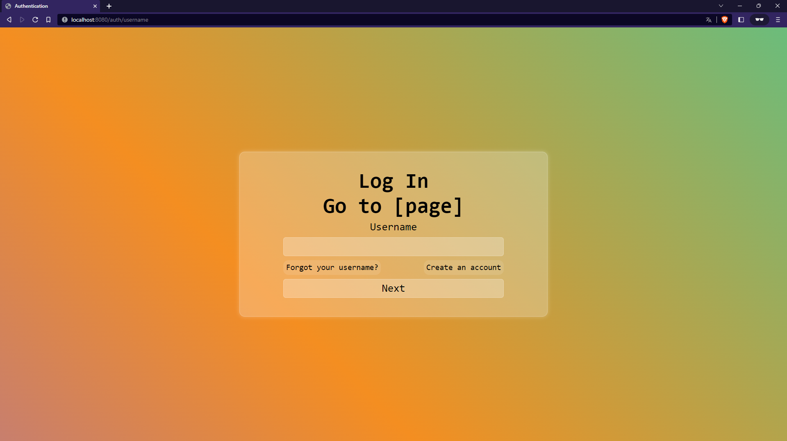
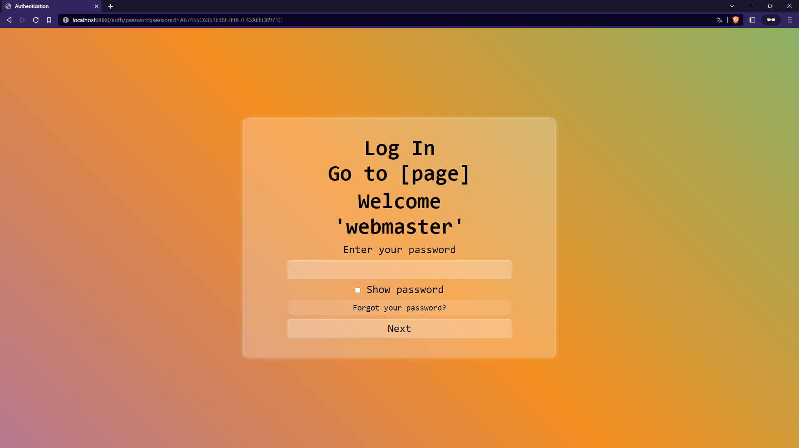
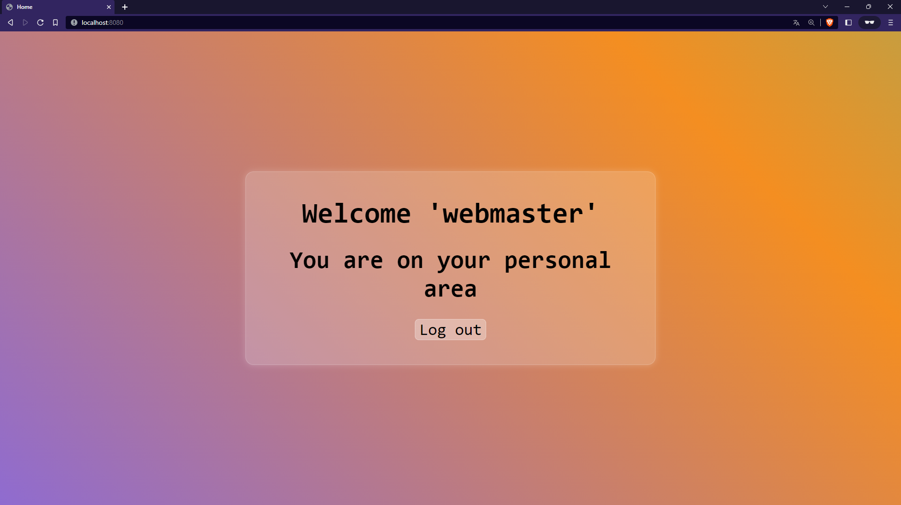

<h1 id="title" align="center">< 🔐 > Cookie Authentication</h1>

This is a web application developed with Spring Boot.

The purpose of this application is to simulate the operation of a standard login in which first the username is requested and then the password.

This application is basic and tries to demonstrate the handling of some basic concepts in spring boot, so it is not protected against manipulation of cookies on the client side.

## Views

<h3 id="read" align="center">Username Window</h3>

<h3 id="read" align="center">Password Window</h3>

<h3 id="read" align="center">Personal Area Window</h3>

    <a href="#title">Back to top</a>

